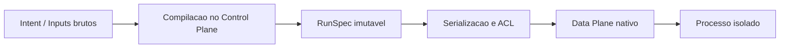

# RunSpec Contract

Este documento explica o `RunSpec` de forma didatica a partir de tres fontes do proprio repositorio:

- [requirements.md](../specs/run_spec/requirements.md)
- [design.md](../specs/run_spec/design.md)
- [runspec_research.pdf](../research/runspec_research.pdf)

A ideia aqui nao e repetir a especificacao inteira. O objetivo e ajudar um leitor a entender:

1. qual problema o `RunSpec` resolve
2. por que ele existe como contrato proprio
3. como ele se encaixa na arquitetura Python + Cython + C++
4. o que ja foi implementado neste repositorio
5. o que ainda esta em aberto

## A ideia central em uma frase

O `RunSpec` e o contrato interno, canonico, imutavel e deterministico que transforma uma intencao de execucao em algo que o runtime pode aplicar com seguranca.

Formula do sistema:

```text
f(RunSpec, RootFS) -> Processo Isolado
```

## Por que esse contrato existe

O PDF de pesquisa deixa claro o problema arquitetural: em qualquer sistema de containers existe um vao entre "o que o usuario pediu" e "o que o kernel realmente executa".

Esse vao aparece porque, no caminho entre a API e o processo isolado, o sistema ainda precisa:

- misturar metadados da imagem
- aplicar defaults da plataforma
- aplicar politicas de seguranca e governanca
- normalizar caminhos
- resolver limites de recursos
- produzir uma forma estavel de serializar e auditar a execucao

Se esse contrato intermediario nao existe, duas coisas tendem a acontecer:

- o control plane passa structs ambiguas para o data plane
- o data plane precisa adivinhar regras de precedencia, defaults e validacoes

O `RunSpec` existe justamente para impedir isso. Ele congela a execucao admitida antes da ida ao runtime nativo.

## A principal tese do design

Tanto o PDF de pesquisa quanto [design.md](../specs/run_spec/design.md) insistem na mesma decisao:

> o `RunSpec` deve ser um contrato de dominio, nao um espelho cru do kernel e nao apenas um DTO de API

Essa e a decisao mais importante do projeto.

Ela significa que:

- o modelo central do sistema nao deve ser "um JSON parecido com OCI"
- o modelo central tambem nao deve ser "o payload flexivel da API"
- o modelo central deve representar a execucao admitida, ja resolvida e sem ambiguidades

Em termos praticos, o sistema passa a ter tres niveis conceituais:

1. `Intent`: o que veio da API, CLI ou imagem
2. `RunSpec`: o contrato admitido, validado e congelado
3. `ExecutionPlan`: a forma concreta usada pelo data plane ou traduzida para OCI

Hoje este repositorio implementa muito bem o nivel 2 e parte relevante da transicao para o nivel 3.

## Como isso se relaciona com Docker e OCI

O material de pesquisa faz uma distincao util:

- Docker historicamente espalha semantica entre `Config`, `HostConfig`, estado do daemon e traducao para runtime
- OCI oferece um contrato de execucao muito mais nitido, proximo do que o runtime precisa

O projeto segue uma posicao intermediaria:

- nao usa a API do Docker como modelo interno
- nao trata OCI como modelo de dominio principal
- usa o `RunSpec` como centro semantico
- deixa OCI e a camada nativa como alvo de traducao

Essa decisao melhora:

- clareza de dominio
- auditabilidade
- evolucao do esquema
- independencia entre API externa e runtime interno

## Como pensar no `RunSpec`

Uma forma simples de entender o objeto e imaginar que ele responde a pergunta:

> "se eu fosse o runtime, o que exatamente eu precisaria saber para criar este processo de forma segura e reproduzivel?"

No design do projeto, essa resposta foi organizada em blocos semanticos:

- `process`: qual processo vai rodar
- `environment`: quais variaveis de ambiente existem no final
- `mounts`: que topologia de filesystem sera aplicada
- `hostname`: qual identidade UTS o processo vera
- `resources`: quais limites de cgroup v2 valem
- `security`: qual envelope de privilegios e restricoes sera aplicado
- `rootfs_path`: onde esta o root filesystem preparado

No codigo, isso aparece diretamente no aggregate root `RunSpec`.

## O fluxo conceitual completo

O design descreve tres fases:



Essas tres fases sao:

1. compilacao
2. serializacao e handoff
3. execucao nativa

Hoje o repositorio cobre muito bem as duas primeiras e modela a terceira parcialmente.

## O que a fase de compilacao faz

Em [design.md](../specs/run_spec/design.md), a compilacao do `RunSpec` e descrita como um pipeline de admissao.

Ele existe para transformar dados ainda ambiguos em um contrato fechado. O pipeline segue sempre esta ordem:

1. resolver precedencia
2. enriquecer com politicas
3. normalizar caminhos
4. validar invariantes cruzadas
5. construir o aggregate root

No repositorio, isso ja esta implementado em:

- `src/runspec_contract/application/protocols.py`
- `src/runspec_contract/application/default_policies.py`
- `src/runspec_contract/application/admission_pipeline.py`
- `src/runspec_contract/domain/factory.py`

### Precedencia

O projeto assume uma ordem fixa de precedencia:

1. metadados da imagem
2. defaults da plataforma
3. politicas
4. overrides do usuario

Isso importa porque o mesmo campo pode aparecer em varias camadas. Sem essa ordem fixa, o contrato final deixaria de ser deterministico.

### Enriquecimento

Depois de resolver quem vence em cada campo, o sistema ainda completa defaults obrigatorios, como:

- `pids.max`
- hierarquia de capabilities
- `no_new_privs` quando ha seccomp
- checagens dependentes das capacidades do kernel

### Normalizacao

A normalizacao lexical de caminhos tambem e parte importante do design.

Isso e especialmente relevante para:

- `cwd`
- destinos de mount
- `rootfs_path`

O PDF chama atencao para o fato de que `cwd` nao e um detalhe cosmetico. Ele e campo de seguranca e precisa ser tratado defensivamente. Essa preocupacao aparece no codigo atual, que normaliza caminhos e rejeita `cwd` fora do `rootfs`.

## O que existe dentro do `RunSpec`

### `ProcessSpec`

Representa o processo inicial:

- `argv`
- `uid`
- `gid`
- `cwd`

O projeto atual ja garante:

- `argv` nao vazio
- `uid` e `gid` numericos nao negativos
- `cwd` como caminho absoluto normalizado

Observacao importante: o requisito original fala em resolver nome de usuario e grupo para UID/GID. O estado atual ainda trabalha apenas com valores numericos ja resolvidos.

### `EnvironmentMap`

Representa o ambiente final do processo.

O ponto principal aqui nao e apenas "guardar variaveis". O ponto principal e tornar a composicao do ambiente:

- deterministica
- auditavel
- ordenada
- sem ambiguidade de precedencia

Por isso o modelo atual guarda as entradas em ordem lexicografica e compila camadas em ordem fixa.

### `MountTopology`

Representa a sequencia ordenada de transformacoes de filesystem.

O PDF e o design tratam `mounts` como parte do contrato de execucao, nao como detalhe tardio do runtime. Isso faz sentido porque a topologia de filesystem muda profundamente o ambiente observado pelo processo.

O codigo atual ja modela:

- `bind mount`
- `tmpfs`
- `propagation`
- `readonly`
- `options`
- unicidade de destinos

### `Hostname`

Representa a identidade UTS.

Se o usuario nao informa hostname, o design recomenda derivar um valor deterministico a partir do hash do contrato. Isso tambem ja foi implementado.

### `ResourceSpec`

Representa governanca de recursos em cgroup v2:

- CPU
- memoria
- PIDs

O ponto importante aqui e que o `RunSpec` nao descreve um desejo vago. Ele descreve limites concretos que depois serao aplicados pelo data plane.

O modelo atual ja contempla:

- `cpu.quota <= cpu.period`
- memoria minima
- `pids.max >= 1`
- clamping contra envelope do pai

### `SecurityEnvelope`

Este e um dos blocos mais importantes do contrato.

Ele agrupa:

- `effective_caps`
- `permitted_caps`
- `bounding_caps`
- `no_new_privs`
- `seccomp_profile`
- `lsm_profile`

O ponto central aqui e que o modelo codifica a ideia de reducao monotona de privilegios. O data plane nao deveria "inventar" isso; ele deveria apenas aplicar o que o contrato ja fixou.

O PDF ainda reforca dois cuidados:

- `privileged` nao deveria ser conceito nativo do dominio
- o data plane precisa desconfiar do control plane e revalidar pontos criticos

O estado atual do codigo segue bem essa linha: ha um envelope explicito e validado, sem introduzir `privileged` como abstracao central.

## As decisoes arquiteturais mais importantes

Combinando o design com o PDF, as decisoes-chave do projeto sao estas:

### 1. Imutabilidade total

Depois de admitido, o contrato nao muda.

Isso importa para:

- auditabilidade
- reproducibilidade
- hashing canonico
- rastreabilidade de eventos

No codigo, isso aparece com `@dataclass(frozen=True, slots=True)` em todo o modelo central.

### 2. Validacao no construtor

Objetos invalidos nao devem existir temporariamente.

Isso simplifica o raciocinio do resto do sistema, porque o aggregate root e o serializer podem assumir que os componentes internos ja respeitam suas invariantes locais.

### 3. Determinismo como requisito de produto

O `RunSpec` nao foi desenhado apenas para "funcionar". Ele foi desenhado para produzir sempre o mesmo contrato para os mesmos insumos.

Isso explica:

- ordenacao de environment
- ordenacao de options
- hash canonico
- snapshots imutaveis entre estagios do pipeline

### 4. ACL como fronteira estrita

O projeto nao quer deixar objetos Python ricos atravessarem a fronteira para o data plane.

A ideia e:

- Python governa a semantica
- Cython faz a ponte
- C++ aplica o contrato perto do kernel

Essa separacao reduz acoplamento e deixa o caminho quente do runtime mais previsivel.

### 5. Data plane defensivo

O PDF destaca isso explicitamente: o data plane nao deve confiar cegamente no control plane.

Mesmo que a validacao principal aconteca em Python, o modulo mais proximo do kernel precisa ser o mais defensivo, porque e ali que estao:

- `pivot_root`
- namespaces
- cgroups
- seccomp
- capabilities

Hoje essa ideia ja aparece no design, mas o data plane real ainda nao foi implementado neste repositorio.

## Visao rapida

| Area | Status | Observacao |
| --- | --- | --- |
| Modelo de dominio do `RunSpec` | Implementado | Value Objects, aggregate root, eventos e erros de dominio |
| Pipeline de compilacao | Implementado | Precedencia, enrichment, normalizacao e factory |
| Hash canonico | Implementado | Calculado de forma deterministica na `RunSpecFactory` |
| Serializacao binaria | Implementado | Envelope `RSPC` com CRC32C |
| ACL Python | Implementado | Validacao, medicao e traducao de erros |
| Probe de kernel | Implementado | cgroups v2, `clone3`, `pidfd`, namespaces, seccomp, `pivot_root` |
| Supervisao por `pidfd` | Implementado | `start`, `wait`, `terminate`, `force_kill`, `reattach` |
| Handoff Cython real para C++ | Parcial | `acl_bridge.pyx` ainda e stub |
| Data plane real | Nao implementado | Sem bootstrap Linux completo |
| Handshake de bootstrap por pipe | Nao implementado | Ainda nao existe `ErrorFrame` real |

## Mapa do codigo

### Camada de dominio

Arquivos principais:

- `src/runspec_contract/domain/types.py`
- `src/runspec_contract/domain/value_objects.py`
- `src/runspec_contract/domain/aggregate.py`
- `src/runspec_contract/domain/events.py`
- `src/runspec_contract/domain/factory.py`
- `src/runspec_contract/domain/exceptions.py`

Essa camada e a implementacao mais madura do projeto hoje.

### Camada de aplicacao

Arquivos principais:

- `src/runspec_contract/application/protocols.py`
- `src/runspec_contract/application/default_policies.py`
- `src/runspec_contract/application/admission_pipeline.py`
- `src/runspec_contract/application/container_supervisor.py`

Aqui estao:

- o pipeline de admissao
- as politicas padrao
- a supervisao de ciclo de vida

### Camada de infraestrutura

Arquivos principais:

- `src/runspec_contract/infrastructure/serializer.py`
- `src/runspec_contract/infrastructure/acl_bridge.py`
- `src/runspec_contract/infrastructure/acl_bridge.pyx`
- `src/runspec_contract/infrastructure/kernel_probe.py`

Aqui estao:

- serializacao binaria
- validacao de checksum
- ponte ACL
- probing do host

### Wiring final

Arquivo principal:

- `src/runspec_contract/bootstrap.py`

Esse modulo junta:

- `KernelProbe`
- `AdmissionPipeline`
- `RunSpecSerializer`
- `CythonBridge`
- `ContainerSupervisor`

Ele existe para transformar componentes isolados em um runtime reutilizavel.

## O que esta bem implementado neste momento

### 1. O contrato de dominio

O centro do projeto ja esta muito consistente.

Ele tem:

- tipos explicitos
- invariantes locais
- invariantes cruzadas
- hash canonico
- eventos de dominio
- hierarquia de erros

### 2. O pipeline de compilacao

O fluxo `Intent -> RunSpec` esta claro no codigo.

Isso importa porque e exatamente essa fatia que transforma inputs dispersos em um contrato sem ambiguidades.

### 3. A serializacao deterministica

O serializer ja materializa um envelope canonicamente ordenado e protegido com `CRC32C`.

Isso e importante para:

- round-trip confiavel
- integridade do handoff
- futura fronteira Cython/C++

### 4. A supervisao operacional

O projeto ja vai alem de "compilar um objeto". Ele ja modela o ciclo de vida operacional:

- iniciar
- esperar
- terminar
- forcar kill
- reanexar

Isso aproxima bastante o repositorio da arquitetura final, mesmo sem o data plane nativo completo.

## O que ainda nao existe

Este ponto precisa ficar explicito para alinhar expectativa com realidade.

Ainda nao existe neste repositorio:

- `clone3 -> namespaces -> mounts -> pivot_root -> seccomp -> execve` real
- handshake filho/pai via `pipe2(O_CLOEXEC)`
- `ErrorFrame` real de bootstrap
- aplicacao real de cgroups v2 leaf no data plane
- bundle OCI completo como produto materializado do handoff
- resolucao de usuario/grupo por nome
- verificacao concreta de existencia do `rootfs` no host
- rede como subsistema acoplado ao contrato

Em outras palavras: o repositorio esta forte em contrato, compilacao, serializacao e supervisao; ainda nao esta completo em execucao nativa real.

## Como o PDF de pesquisa ajuda a ler o codigo atual

O PDF ajuda bastante a interpretar por que certas escolhas do codigo fazem sentido:

### "O `RunSpec` e a execucao admitida"

Isso aparece diretamente no `AdmissionPipeline` e na `RunSpecFactory`. O sistema nao trata o payload bruto como contrato final.

### "O contrato deve ser mais limpo que a API externa"

Isso aparece no uso de snapshots internos (`ResolvedInputs`, `EnrichedInputs`, `NormalizedInputs`) antes da construcao do aggregate.

### "Nao tratar `privileged` como conceito central"

Isso aparece no fato de o projeto modelar `SecurityEnvelope` explicitamente em vez de depender de um atalho opaco.

### "Tratar `cwd` como campo de risco"

Isso aparece no cuidado com caminhos absolutos, normalizacao lexical e contencao dentro do `rootfs`.

### "O data plane deve desconfiar do control plane"

Isso ainda e mais um principio do design do que uma implementacao completa, mas a separacao entre dominio, ACL e data plane ja prepara esse caminho.

## Estrategia de testes

Os testes acompanham bem a filosofia do design:

- testes unitarios de value objects
- testes de pipeline
- testes da ACL
- testes do supervisor
- testes de integracao do bootstrap
- property-based testing com Hypothesis

Esse ponto importa porque o design nao fala apenas em "subir um container". Ele fala em preservar corretude universal de invariantes.

Resultado atual da suite:

```powershell
pytest -q
```

```text
77 passed in 11.11s
```

## Como ler o projeto pela primeira vez

Se voce quer entender o `RunSpec` sem se perder, esta ordem funciona bem:

1. ler este documento
2. ler `research/runspec_research.pdf` para entender a motivacao arquitetural
3. ler `specs/run_spec/design.md` para entender o desenho alvo
4. ler `src/runspec_contract/domain/value_objects.py`
5. ler `src/runspec_contract/domain/aggregate.py`
6. ler `src/runspec_contract/domain/factory.py`
7. ler `src/runspec_contract/application/default_policies.py`
8. ler `src/runspec_contract/application/admission_pipeline.py`
9. ler `src/runspec_contract/infrastructure/serializer.py`
10. ler `src/runspec_contract/bootstrap.py`

Essa ordem ajuda porque ela vai da motivacao para o contrato, depois do contrato para o pipeline, e por fim do pipeline para a fronteira de execucao.

## Resumo final

Se for para resumir o estado atual em poucas linhas:

- o projeto ja tem um `RunSpec` forte como contrato de dominio
- o pipeline de compilacao ja e coerente com a especificacao
- a serializacao e a ACL Python ja estao bem encaminhadas
- a supervisao de ciclo de vida ja esta modelada
- a execucao Linux real ainda e a principal area faltante

Esse e um bom ponto de arquitetura, porque o centro semantico do sistema ja existe. O proximo passo nao e "inventar o contrato"; e fazer o data plane nativo obedecer a esse contrato com o mesmo rigor.
