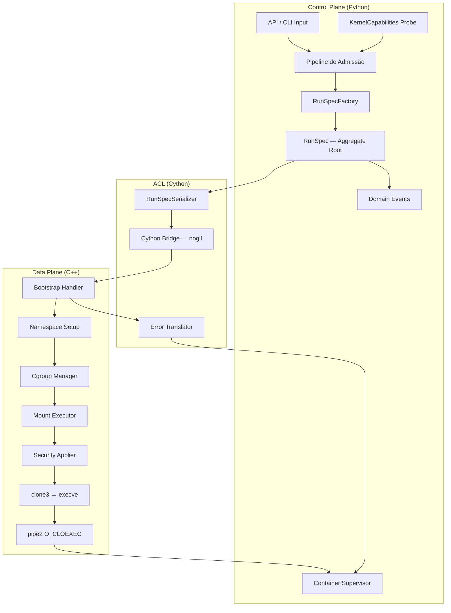
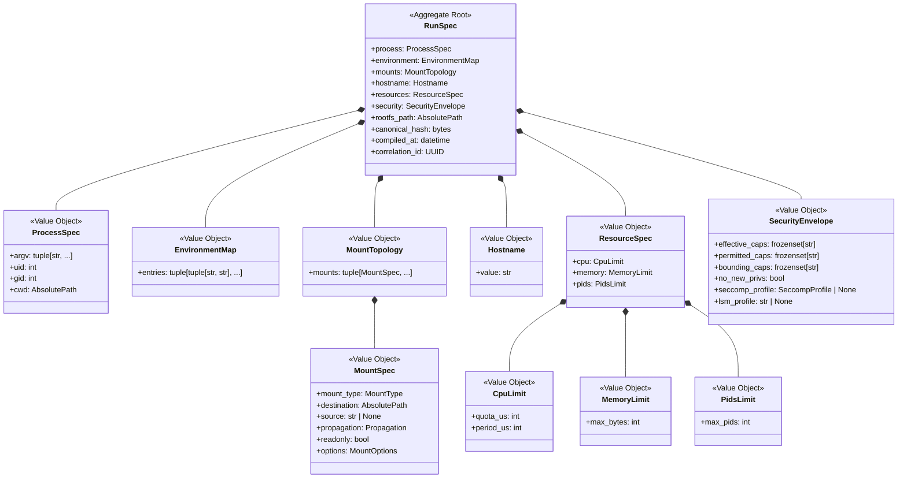
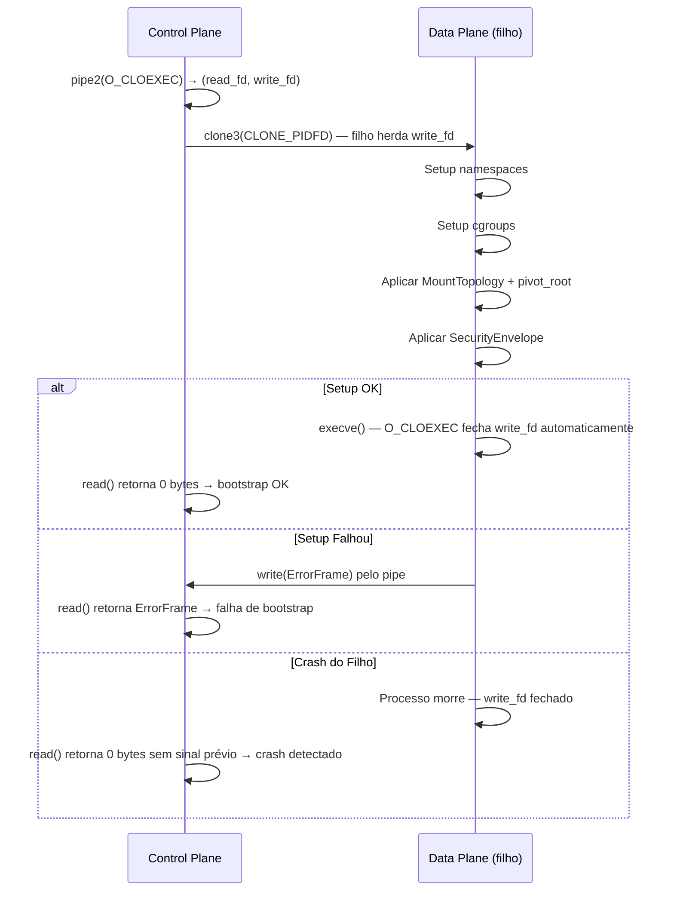
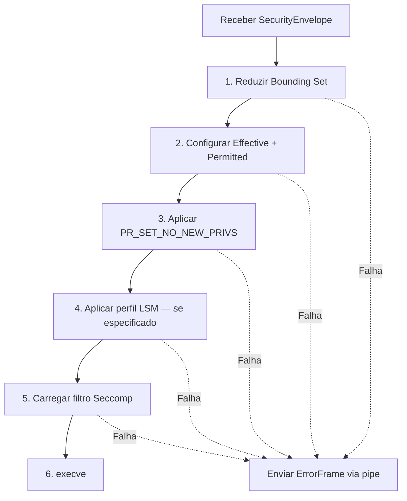

# Documento de Design — RunSpec Contract

## Visão Geral

O RunSpec é a raiz de agregado (Aggregate Root) imutável que serve como contrato canônico entre o Control Plane (Python) e o Data Plane (C++). Ele encapsula toda a informação necessária para descrever um processo isolado: processo, ambiente, montagens, hostname, recursos, segurança e caminho do rootfs.

A função central do sistema é: `f(RunSpec, RootFS) → Processo Isolado`.

O ciclo de vida do RunSpec segue três fases:

1. **Compilação** (Control Plane): O Pipeline de Admissão transforma inputs brutos (metadados OCI, overrides de CLI/API, políticas) em um RunSpec imutável e validado.
2. **Serialização e Handoff** (ACL): O RunSpec é serializado em formato binário canônico, verificado por checksum, e transmitido pela fronteira Cython com liberação de GIL.
3. **Execução** (Data Plane): O Data Plane consome o RunSpec deserializado para configurar namespaces, cgroups, montagens, segurança e executar o processo via clone3→execve.

### Decisões Arquiteturais Chave

- **Imutabilidade total**: RunSpec e todos os Value Objects usam `@dataclass(frozen=True)`. Nenhuma mutação é permitida após compilação.
- **Validação no construtor**: Invariantes são verificadas no `__post_init__` de cada Value Object. Objetos inválidos nunca existem.
- **Domínio comportamental**: Lógica de negócio reside nos Value Objects e no Aggregate Root, não em services externos.
- **ACL como fronteira estrita**: Nenhum `PyObject*` ou `dict` genérico cruza a fronteira. Tipagem estrita Cython com `nogil`.
- **Serialização determinística**: Ordenação fixa de campos, formato binário canônico, checksum de integridade.

## Arquitetura

### Diagrama de Componentes



### Diagrama do Pipeline de Admissão


**Camadas de Precedência (ordem fixa):**
1. Metadados de imagem (menor precedência)
2. Defaults de plataforma
3. Injeção de políticas
4. Overrides do usuário (maior precedência)

### Bounded Context

O RunSpec Contract pertence ao bounded context de **Compilação e Execução de Containers**. As fronteiras são:

- **Entrada**: API/CLI externa → ACL de entrada traduz DTOs/OCI para modelo de domínio
- **Saída**: RunSpec serializado → ACL Cython traduz para representação C-compatível
- **Eventos**: Domain Events publicados para contextos externos (monitoramento, auditoria)


## Componentes e Interfaces

### 1. Pipeline de Admissão

O Pipeline de Admissão é um Domain Service que orquestra a compilação do RunSpec a partir de inputs brutos. Ele é composto por três estágios sequenciais, cada um implementado como uma Policy substituível:

```python
class PrecedenceResolutionPolicy(Protocol):
    """Resolve camadas de precedência em valores finais."""
    def resolve(self, image_metadata: ImageMetadata,
                platform_defaults: PlatformDefaults,
                policy_injection: PolicyConfig,
                user_overrides: UserOverrides) -> ResolvedInputs: ...

class PolicyEnrichmentPolicy(Protocol):
    """Enriquece inputs resolvidos com configurações mandatórias de segurança e recursos."""
    def enrich(self, resolved: ResolvedInputs,
               kernel_caps: KernelCapabilities) -> EnrichedInputs: ...

class PathNormalizationPolicy(Protocol):
    """Normaliza e valida todos os caminhos (CWD, montagens, rootfs)."""
    def normalize(self, enriched: EnrichedInputs) -> NormalizedInputs: ...
```

**AdmissionPipeline** (Domain Service):
```python
class AdmissionPipeline:
    def __init__(self, precedence: PrecedenceResolutionPolicy,
                 enrichment: PolicyEnrichmentPolicy,
                 normalization: PathNormalizationPolicy) -> None: ...

    def compile(self, raw_inputs: RawCompilationInputs,
                kernel_caps: KernelCapabilities) -> RunSpec: ...
```

### 2. RunSpecFactory

Factory responsável pela construção atômica do RunSpec. Recebe inputs normalizados e validados, constrói cada Value Object, valida invariantes cruzadas e retorna o agregado imutável.

```python
class RunSpecFactory:
    @staticmethod
    def create(normalized: NormalizedInputs) -> RunSpec: ...
```

### 3. RunSpecSerializer (ACL)

Responsável pela serialização/desserialização do RunSpec para formato binário canônico:

```python
class RunSpecSerializer:
    def serialize(self, runspec: RunSpec) -> bytes: ...
    def deserialize(self, data: bytes) -> RunSpec: ...
```

### 4. CythonBridge (ACL)

Ponte Cython que libera o GIL e invoca o Data Plane:

```python
class CythonBridge:
    def execute(self, serialized_runspec: bytes, rootfs_path: str) -> ExecutionResult: ...
```

### 5. ContainerSupervisor

Supervisiona o ciclo de vida do container via pidfd:

```python
class ContainerSupervisor:
    def start(self, runspec: RunSpec, rootfs_path: str) -> ContainerHandle: ...
    def wait(self, handle: ContainerHandle) -> ContainerExitStatus: ...
    def terminate(self, handle: ContainerHandle, timeout_seconds: float) -> None: ...
    def force_kill(self, handle: ContainerHandle) -> None: ...
    def reattach(self, container_id: ContainerId) -> ContainerHandle: ...
```

### 6. KernelProbe

Realiza probing de features do kernel na inicialização:

```python
class KernelProbe:
    def probe(self) -> KernelCapabilities: ...
```


## Modelos de Dados

### Diagrama de Agregado



### Value Objects — Definições Detalhadas

#### ProcessSpec

```python
@dataclass(frozen=True)
class ProcessSpec:
    """Especificação do processo a ser executado no container.

    Invariantes:
    - argv é não-vazio; primeiro elemento é o caminho do executável
    - uid e gid são inteiros não-negativos (já resolvidos de nomes)
    - cwd é caminho absoluto normalizado (sem componentes '..')
    """
    argv: tuple[str, ...]
    uid: int
    gid: int
    cwd: AbsolutePath

    def __post_init__(self) -> None:
        if not self.argv:
            raise DomainError("argv deve conter pelo menos um elemento.")
        if any(not isinstance(a, str) for a in self.argv):
            raise DomainError("Todos os elementos de argv devem ser strings.")
        if self.uid < 0:
            raise DomainError(f"UID inválido: {self.uid}")
        if self.gid < 0:
            raise DomainError(f"GID inválido: {self.gid}")
```

#### EnvironmentMap

```python
@dataclass(frozen=True)
class EnvironmentMap:
    """Variáveis de ambiente compiladas deterministicamente.

    Invariantes:
    - Pares ordenados lexicograficamente por chave
    - Chaves não-vazias e sem caractere '='
    - Imutável após construção
    """
    entries: tuple[tuple[str, str], ...]

    def __post_init__(self) -> None:
        keys = [k for k, _ in self.entries]
        for key in keys:
            if not key:
                raise DomainError("Chave de variável de ambiente não pode ser vazia.")
            if "=" in key:
                raise DomainError(f"Chave '{key}' contém caractere '=' inválido.")
        if keys != sorted(keys):
            raise DomainError("Entradas devem estar em ordem lexicográfica por chave.")
        if len(keys) != len(set(keys)):
            raise DomainError("Chaves duplicadas detectadas no EnvironmentMap.")

    @classmethod
    def compile_from_layers(cls, *layers: dict[str, str]) -> "EnvironmentMap":
        """Compila EnvironmentMap a partir de camadas de precedência (menor → maior)."""
        merged: dict[str, str] = {}
        for layer in layers:
            merged.update(layer)
        sorted_entries = tuple(sorted(merged.items(), key=lambda kv: kv[0]))
        return cls(entries=sorted_entries)
```

#### MountSpec e MountTopology

```python
class MountType(Enum):
    BIND = "bind"
    TMPFS = "tmpfs"

class Propagation(Enum):
    RPRIVATE = "rprivate"
    RSLAVE = "rslave"

@dataclass(frozen=True)
class MountSpec:
    """Transformação VFS individual.

    Invariantes:
    - destination é caminho absoluto normalizado
    - source é obrigatório para bind mounts, None para tmpfs
    - propagation padrão é RPRIVATE
    """
    mount_type: MountType
    destination: AbsolutePath
    source: str | None
    propagation: Propagation = Propagation.RPRIVATE
    readonly: bool = False

    def __post_init__(self) -> None:
        if self.mount_type == MountType.BIND and self.source is None:
            raise DomainError("Bind mount requer source.")
        if self.mount_type == MountType.TMPFS and self.source is not None:
            raise DomainError("tmpfs não aceita source.")

@dataclass(frozen=True)
class MountTopology:
    """Sequência ordenada de montagens VFS.

    Invariantes:
    - Sem destinos duplicados
    - Ordem define sequência de aplicação
    - Imutável após construção
    """
    mounts: tuple[MountSpec, ...]

    def __post_init__(self) -> None:
        destinations = [m.destination for m in self.mounts]
        if len(destinations) != len(set(destinations)):
            raise DomainError("Destinos de montagem duplicados detectados.")
```

#### Hostname

```python
import re

_HOSTNAME_PATTERN = re.compile(r'^[a-zA-Z0-9]([a-zA-Z0-9-]{0,62}[a-zA-Z0-9])?$')

@dataclass(frozen=True)
class Hostname:
    """Hostname POSIX-compliant.

    Invariantes:
    - 1-64 caracteres
    - Apenas [a-zA-Z0-9-]
    - Não começa/termina com hífen
    """
    value: str

    def __post_init__(self) -> None:
        if not self.value:
            raise DomainError("Hostname não pode ser vazio.")
        if len(self.value) > 64:
            raise DomainError(f"Hostname excede 64 caracteres: {len(self.value)}")
        if not _HOSTNAME_PATTERN.match(self.value):
            raise DomainError(f"Hostname inválido: '{self.value}'")

    @classmethod
    def from_hash(cls, canonical_hash: bytes) -> "Hostname":
        """Gera hostname determinístico a partir dos primeiros 12 hex do hash."""
        return cls(value=canonical_hash[:6].hex())
```

#### ResourceSpec

```python
MIN_MEMORY_BYTES = 4_194_304  # 4 MiB
MIN_PIDS = 1

@dataclass(frozen=True)
class CpuLimit:
    """Limite de CPU via cpu.max.

    Invariantes:
    - quota_us > 0
    - period_us > 0
    - quota_us <= period_us
    """
    quota_us: int
    period_us: int

    def __post_init__(self) -> None:
        if self.quota_us <= 0:
            raise DomainError(f"cpu.quota deve ser positivo: {self.quota_us}")
        if self.period_us <= 0:
            raise DomainError(f"cpu.period deve ser positivo: {self.period_us}")
        if self.quota_us > self.period_us:
            raise DomainError(
                f"cpu.quota ({self.quota_us}) não pode exceder cpu.period ({self.period_us})"
            )

@dataclass(frozen=True)
class MemoryLimit:
    """Limite de memória via memory.max.

    Invariantes:
    - max_bytes >= 4 MiB (4194304)
    """
    max_bytes: int

    def __post_init__(self) -> None:
        if self.max_bytes < MIN_MEMORY_BYTES:
            raise DomainError(
                f"memory.max ({self.max_bytes}) abaixo do mínimo de {MIN_MEMORY_BYTES} bytes (4 MiB)"
            )

@dataclass(frozen=True)
class PidsLimit:
    """Limite de PIDs via pids.max.

    Invariantes:
    - max_pids >= 1
    """
    max_pids: int

    def __post_init__(self) -> None:
        if self.max_pids < MIN_PIDS:
            raise DomainError(f"pids.max ({self.max_pids}) abaixo do mínimo de {MIN_PIDS}")

@dataclass(frozen=True)
class ResourceSpec:
    """Governança de recursos via cgroups v2.

    Invariantes:
    - Todos os sub-limites satisfazem suas invariantes individuais
    - Imutável após construção
    """
    cpu: CpuLimit
    memory: MemoryLimit
    pids: PidsLimit

    def clamp_to_parent(self, parent_cpu_quota: int, parent_cpu_period: int,
                        parent_memory_max: int, parent_pids_max: int) -> "ResourceSpec":
        """Retorna novo ResourceSpec com valores ajustados aos limites do cgroup pai."""
        return ResourceSpec(
            cpu=CpuLimit(
                quota_us=min(self.cpu.quota_us, parent_cpu_quota),
                period_us=self.cpu.period_us,
            ),
            memory=MemoryLimit(max_bytes=min(self.memory.max_bytes, parent_memory_max)),
            pids=PidsLimit(max_pids=min(self.pids.max_pids, parent_pids_max)),
        )
```

#### SecurityEnvelope

```python
@dataclass(frozen=True)
class SecurityEnvelope:
    """Envelope de segurança para redução irreversível de privilégios.

    Invariantes:
    - effective ⊆ permitted ⊆ bounding
    - Se seccomp_profile presente, no_new_privs deve ser True
    - Imutável após construção
    """
    effective_caps: frozenset[str]
    permitted_caps: frozenset[str]
    bounding_caps: frozenset[str]
    no_new_privs: bool
    seccomp_profile: SeccompProfile | None = None
    lsm_profile: str | None = None

    def __post_init__(self) -> None:
        # Invariante: effective ⊆ permitted
        overflow_eff = self.effective_caps - self.permitted_caps
        if overflow_eff:
            raise DomainError(
                f"Capabilities effective não contidas em permitted: {overflow_eff}"
            )
        # Invariante: permitted ⊆ bounding
        overflow_perm = self.permitted_caps - self.bounding_caps
        if overflow_perm:
            raise DomainError(
                f"Capabilities permitted não contidas em bounding: {overflow_perm}"
            )
        # Invariante: seccomp requer no_new_privs
        if self.seccomp_profile is not None and not self.no_new_privs:
            raise DomainError(
                "Perfil seccomp requer no_new_privs=True (SECCOMP_FILTER exige PR_SET_NO_NEW_PRIVS)"
            )
```

#### KernelCapabilities

```python
@dataclass(frozen=True)
class KernelCapabilities:
    """Resultado do probing de features do kernel. Imutável e cacheado.

    Valida na inicialização: cgroups v2, clone3, pidfd, namespaces, seccomp, pivot_root.
    Versão mínima do kernel: 5.3.
    """
    kernel_version: tuple[int, int, int]
    has_cgroups_v2: bool
    has_clone3: bool
    has_pidfd: bool
    has_user_ns: bool
    has_pid_ns: bool
    has_mount_ns: bool
    has_uts_ns: bool
    has_net_ns: bool
    has_seccomp: bool
    has_pivot_root: bool
    available_cgroup_controllers: frozenset[str]

    def validate_minimum_requirements(self) -> None:
        """Valida requisitos mínimos. Levanta DomainError se não atendidos."""
        if self.kernel_version < (5, 3, 0):
            raise DomainError(
                f"Kernel {self.kernel_version} abaixo da versão mínima 5.3.0"
            )
        if not self.has_cgroups_v2:
            raise DomainError("cgroups v2 não disponível. cgroups v1 não é suportado.")
        required = {
            "clone3": self.has_clone3,
            "pidfd": self.has_pidfd,
            "seccomp": self.has_seccomp,
            "pivot_root": self.has_pivot_root,
        }
        missing = [name for name, available in required.items() if not available]
        if missing:
            raise DomainError(f"Features obrigatórias do kernel ausentes: {missing}")
```

#### RunSpec — Aggregate Root

```python
@dataclass(frozen=True)
class RunSpec:
    """Raiz de agregado imutável — contrato de execução canônico.

    Invariantes:
    - Todos os Value Objects internos satisfazem suas invariantes
    - rootfs_path é caminho absoluto existente
    - CWD do ProcessSpec está contido dentro do rootfs_path
    - canonical_hash é determinístico para os mesmos inputs
    - Imutável após compilação
    """
    process: ProcessSpec
    environment: EnvironmentMap
    mounts: MountTopology
    hostname: Hostname
    resources: ResourceSpec
    security: SecurityEnvelope
    rootfs_path: AbsolutePath
    canonical_hash: bytes
    compiled_at: datetime
    correlation_id: UUID

    def __post_init__(self) -> None:
        # Validação cruzada: CWD dentro do rootfs
        if not self.process.cwd.startswith(self.rootfs_path):
            raise DomainError(
                f"CWD '{self.process.cwd}' não está contido em rootfs '{self.rootfs_path}'"
            )
```

### Eventos de Domínio

Todos os eventos são imutáveis (`frozen=True`), nomeados no passado, e contêm metadados de rastreabilidade.

```python
@dataclass(frozen=True)
class DomainEvent:
    """Classe base para eventos de domínio."""
    event_id: UUID
    occurred_at: datetime
    correlation_id: UUID

@dataclass(frozen=True)
class RunSpecCompiled(DomainEvent):
    """Emitido quando um RunSpec é compilado com sucesso."""
    runspec_hash: bytes

@dataclass(frozen=True)
class ContainerStarted(DomainEvent):
    """Emitido quando um container inicia execução após handshake de bootstrap."""
    container_id: UUID
    runspec_hash: bytes
    pidfd: int

@dataclass(frozen=True)
class ContainerExited(DomainEvent):
    """Emitido quando um container termina por qualquer motivo."""
    container_id: UUID
    exit_code: int
    signal: int | None
    duration_seconds: float

@dataclass(frozen=True)
class ContainerOOMKilled(DomainEvent):
    """Emitido quando um container é terminado por OOM killer."""
    container_id: UUID
    memory_limit: int

@dataclass(frozen=True)
class ContainerForceKilled(DomainEvent):
    """Emitido quando um container é terminado forçadamente via cgroup.kill."""
    container_id: UUID
    reason: str
```

### Serialização

#### Estratégia

O RunSpec é serializado em formato binário canônico para travessia da fronteira ACL. A estratégia usa:

1. **Ordenação determinística de campos**: Campos são serializados em ordem fixa definida pelo schema (não pela ordem de declaração Python).
2. **Formato**: Struct-based binary com header de versão + campos length-prefixed.
3. **Checksum**: CRC32C no final do payload para detecção de corrupção.
4. **Propriedade round-trip**: `serialize(deserialize(serialize(rs))) == serialize(rs)` para todo RunSpec válido.

#### Formato do Payload

```
┌──────────────┬──────────────┬─────────────────┬──────────────┐
│ Magic (4B)   │ Version (2B) │ Payload (var)   │ CRC32C (4B)  │
└──────────────┴──────────────┴─────────────────┴──────────────┘
```

- **Magic**: `0x52535043` ("RSPC" — RunSpec Contract)
- **Version**: Versão do formato (uint16, big-endian)
- **Payload**: Campos serializados em ordem fixa, cada um length-prefixed (uint32 big-endian + bytes)
- **CRC32C**: Checksum sobre Magic + Version + Payload

#### Ordem de Serialização dos Campos

1. `process` (ProcessSpec)
2. `environment` (EnvironmentMap)
3. `mounts` (MountTopology)
4. `hostname` (Hostname)
5. `resources` (ResourceSpec)
6. `security` (SecurityEnvelope)
7. `rootfs_path`
8. `compiled_at` (ISO 8601 UTC)
9. `correlation_id` (UUID bytes)

### Handshake de Bootstrap (Protocolo)

O protocolo de sincronização entre Control Plane e Data Plane usa `pipe2(O_CLOEXEC)`:



#### ErrorFrame (estrutura do frame de erro)

```
┌──────────────┬──────────────┬──────────────────┐
│ Phase (1B)   │ ErrCode (4B) │ Message (var)    │
└──────────────┴──────────────┴──────────────────┘
```

- **Phase**: Enum indicando a fase que falhou (namespace=1, cgroup=2, mount=3, security=4, exec=5)
- **ErrCode**: Código errno do sistema
- **Message**: String UTF-8 descritiva, length-prefixed

### Fronteira ACL — Design Detalhado

A ACL Cython segue estas regras:

1. **Tradução estrita**: RunSpec Python → struct C com campos tipados. Nenhum `PyObject*` ou `dict`.
2. **Liberação de GIL**: `with nogil:` durante toda a chamada ao Data Plane.
3. **Tradução de erros**: Códigos de erro C++ → exceções de domínio Python. Sem vazamento de detalhes de implementação.
4. **Validação de integridade**: Checksum verificado antes de passar ao Data Plane.
5. **Métricas de timing**: Latência medida; aviso se > 2ms.

```python
# Pseudocódigo Cython
cdef class CythonBridge:
    cdef int _execute_native(self, const unsigned char* data,
                              size_t length, const char* rootfs) nogil:
        # Chamada ao Data Plane C++ — GIL liberado
        return native_execute(data, length, rootfs)

    def execute(self, serialized: bytes, rootfs_path: str) -> ExecutionResult:
        start = time.monotonic_ns()
        cdef int result
        with nogil:
            result = self._execute_native(serialized, len(serialized), rootfs_path)
        elapsed_ms = (time.monotonic_ns() - start) / 1_000_000
        if elapsed_ms > 2.0:
            logger.warning("ACL traversal exceeded 2ms", elapsed_ms=elapsed_ms)
        if result < 0:
            raise self._translate_error(result)
        return ExecutionResult(pidfd=result)
```

### Sequência de Redução de Privilégios (Data Plane)

A ordem de aplicação é irreversível e fixa:



## Propriedades de Corretude

*Uma propriedade é uma característica ou comportamento que deve ser verdadeiro em todas as execuções válidas de um sistema — essencialmente, uma declaração formal sobre o que o sistema deve fazer. Propriedades servem como ponte entre especificações legíveis por humanos e garantias de corretude verificáveis por máquina.*

### Property 1: Round-trip de Serialização

*Para qualquer* RunSpec válido `rs`, `serialize(deserialize(serialize(rs)))` deve produzir bytes idênticos a `serialize(rs)`, e `deserialize(serialize(rs))` deve ser semanticamente equivalente a `rs`.

**Validates: Requirements 2.1, 2.2, 2.3**

### Property 2: Detecção de Corrupção via Checksum

*Para qualquer* RunSpec válido serializado em bytes, se qualquer byte do payload (exceto o checksum) for alterado sem atualizar o checksum, a desserialização deve falhar com erro de integridade. Adicionalmente, para qualquer sequência de bytes aleatória (não produzida pelo serializer), a desserialização deve retornar erro estruturado, nunca um RunSpec parcial.

**Validates: Requirements 2.4, 2.5, 2.6, 14.4**

### Property 3: Determinismo de Compilação

*Para qualquer* conjunto de inputs válidos de compilação (metadados de imagem, defaults de plataforma, políticas, overrides do usuário), compilar o RunSpec duas vezes com os mesmos inputs deve produzir RunSpecs com hash canônico idêntico.

**Validates: Requirements 1.1, 4.5**

### Property 4: Precedência de Camadas do EnvironmentMap

*Para qualquer* conjunto de camadas de variáveis de ambiente onde duas ou mais camadas definem a mesma chave, o valor final no EnvironmentMap compilado deve ser o da camada de maior precedência (overrides do usuário > injeção de políticas > defaults de plataforma > metadados de imagem), e as entradas devem estar em ordem lexicográfica por chave.

**Validates: Requirements 1.2, 4.1, 4.2, 4.3**

### Property 5: Imutabilidade do RunSpec e Value Objects

*Para qualquer* RunSpec compilado e todos os seus Value Objects internos (ProcessSpec, EnvironmentMap, MountTopology, Hostname, ResourceSpec, SecurityEnvelope), tentativas de mutação de qualquer atributo devem levantar erro (FrozenInstanceError), garantindo imutabilidade total após construção.

**Validates: Requirements 1.4, 4.3, 5.7, 7.8, 8.8**

### Property 6: Validação de Invariantes dos Value Objects

*Para qualquer* conjunto de parâmetros que viola as invariantes de um Value Object (argv vazio no ProcessSpec, chave vazia ou com '=' no EnvironmentMap, destinos duplicados no MountTopology, hostname com caracteres inválidos, cpu.quota > cpu.period, memória < 4MiB, pids < 1), a construção do Value Object deve falhar com erro de domínio descritivo, e o RunSpec nunca deve ser composto com Value Objects inválidos.

**Validates: Requirements 1.3, 1.6, 3.1, 4.4, 5.6, 6.1, 6.2, 7.1, 7.2, 7.3, 7.4, 7.5**

### Property 7: Invariante de Subconjunto de Capabilities

*Para qualquer* SecurityEnvelope válido, o conjunto effective deve ser subconjunto do conjunto permitted, e o conjunto permitted deve ser subconjunto do bounding set. Para qualquer combinação que viole essa relação, a construção deve falhar com erro de domínio indicando as capabilities inconsistentes.

**Validates: Requirements 8.1, 8.2, 8.3**

### Property 8: Seccomp Requer no_new_privs

*Para qualquer* SecurityEnvelope com perfil seccomp especificado e `no_new_privs=False`, a construção deve falhar com erro de domínio. Para qualquer SecurityEnvelope com perfil seccomp e `no_new_privs=True`, a construção deve ser aceita (desde que as demais invariantes sejam satisfeitas).

**Validates: Requirements 8.6**

### Property 9: Normalização de Caminhos é Idempotente

*Para qualquer* caminho absoluto contendo componentes de travessia de diretório (`..`), a normalização deve produzir um caminho canônico sem `..`. Aplicar a normalização duas vezes deve produzir o mesmo resultado que aplicar uma vez (idempotência). Adicionalmente, para qualquer caminho não-absoluto, a validação deve rejeitar com erro de domínio.

**Validates: Requirements 3.4, 3.5, 3.6, 5.4, 5.5**

### Property 10: CWD Contido no RootFS

*Para qualquer* RunSpec, o CWD do ProcessSpec (após normalização) deve ser um subcaminho do rootfs_path. Para qualquer CWD normalizado que não é prefixo do rootfs_path, a construção do RunSpec deve falhar com erro de domínio.

**Validates: Requirements 10.1, 10.6**

### Property 11: Hostname Determinístico a partir do Hash

*Para qualquer* hash canônico de RunSpec, o hostname gerado por `Hostname.from_hash()` deve ser composto pelos primeiros 12 caracteres hexadecimais do hash, e deve ser um hostname POSIX válido (1-64 chars, [a-zA-Z0-9-], sem hífen no início/fim).

**Validates: Requirements 6.3**

### Property 12: Clamping Hierárquico de Recursos

*Para qualquer* ResourceSpec e limites de cgroup pai, o resultado de `clamp_to_parent()` deve produzir um ResourceSpec onde todos os valores são menores ou iguais aos limites do pai, e todos os valores satisfazem os mínimos absolutos (memória >= 4MiB, pids >= 1, quota <= period).

**Validates: Requirements 7.6, 7.7**

### Property 13: Destinos de Montagem Únicos

*Para qualquer* lista de MountSpecs onde dois ou mais possuem o mesmo caminho de destino, a construção de MountTopology deve falhar com erro de domínio indicando conflito. Para qualquer lista sem duplicatas, a construção deve preservar a ordem original.

**Validates: Requirements 5.1, 5.6**

### Property 14: Propagação Padrão de Montagem

*Para qualquer* MountSpec construído sem propagação explícita, o valor de propagação deve ser `RPRIVATE`. Para qualquer MountSpec com propagação explícita (`RPRIVATE` ou `RSLAVE`), o valor deve ser preservado.

**Validates: Requirements 5.2, 5.3**

### Property 15: Eventos de Domínio Imutáveis com Metadados

*Para qualquer* evento de domínio (RunSpecCompiled, ContainerStarted, ContainerExited, ContainerOOMKilled, ContainerForceKilled), o evento deve ser imutável (frozen), conter `event_id`, `occurred_at` e `correlation_id`, e cada tipo deve conter seus campos específicos obrigatórios. Tentativas de mutação devem levantar erro.

**Validates: Requirements 1.5, 13.3, 16.4, 18.1, 18.2, 18.3, 18.4, 18.5, 18.6**

### Property 16: Round-trip do ErrorFrame

*Para qualquer* ErrorFrame válido (phase, error_code, message), serializar e desserializar deve produzir um ErrorFrame semanticamente equivalente ao original.

**Validates: Requirements 9.3**

### Property 17: Tradução de Erros na ACL

*Para qualquer* código de erro nativo retornado pelo Data Plane, a ACL deve traduzir para uma exceção de domínio Python descritiva, sem expor detalhes de implementação C++. O mapeamento deve ser determinístico: o mesmo código de erro sempre produz a mesma classe de exceção.

**Validates: Requirements 14.3**

### Property 18: KernelCapabilities Valida Requisitos Mínimos

*Para qualquer* KernelCapabilities com versão de kernel < 5.3 ou sem cgroups v2, `validate_minimum_requirements()` deve levantar erro de domínio. Para qualquer KernelCapabilities que atende todos os requisitos mínimos, a validação deve passar sem erro.

**Validates: Requirements 15.1, 15.2, 15.3, 15.5**

### Property 19: pids.max Sempre Presente

*Para qualquer* ResourceSpec válido, o campo `pids.max` deve ter um valor inteiro >= 1. Não deve ser possível construir um ResourceSpec sem especificar pids.max.

**Validates: Requirements 16.1**

## Tratamento de Erros

### Hierarquia de Exceções de Domínio

```python
class DomainError(Exception):
    """Erro base do domínio RunSpec."""
    pass

class CompilationError(DomainError):
    """Erro durante compilação do RunSpec."""
    pass

class ValidationError(CompilationError):
    """Violação de invariante de um Value Object."""
    field: str
    detail: str

class CrossValidationError(CompilationError):
    """Violação de invariante cruzada entre Value Objects."""
    fields: tuple[str, ...]
    detail: str

class SerializationError(DomainError):
    """Erro durante serialização/desserialização."""
    pass

class ChecksumError(SerializationError):
    """Checksum do payload não corresponde aos bytes."""
    expected: bytes
    actual: bytes

class CorruptedPayloadError(SerializationError):
    """Payload corrompido ou truncado."""
    detail: str

class KernelFeatureError(DomainError):
    """Feature obrigatória do kernel ausente."""
    feature: str
    detail: str

class BootstrapError(DomainError):
    """Erro durante bootstrap do container."""
    phase: str
    errno: int
    detail: str

class ACLError(DomainError):
    """Erro na fronteira ACL."""
    native_code: int
    detail: str
```

### Estratégia de Tratamento por Camada

| Camada | Tipo de Erro | Tratamento |
|--------|-------------|------------|
| Value Object (`__post_init__`) | Invariante violada | `ValidationError` com campo e detalhe |
| RunSpecFactory | Invariante cruzada | `CrossValidationError` com campos envolvidos |
| Pipeline de Admissão | Input inválido | `CompilationError` com contexto da fase |
| Serializer | Corrupção/truncamento | `SerializationError` ou `ChecksumError` |
| ACL Bridge | Erro nativo C++ | `ACLError` traduzido, sem detalhes C++ |
| Bootstrap (Data Plane) | Falha de setup | `BootstrapError` via ErrorFrame no pipe |
| KernelProbe | Feature ausente | `KernelFeatureError` com feature e detalhe |

### Princípios

1. **Fail-fast**: Erros são detectados o mais cedo possível (no construtor do Value Object).
2. **Erros descritivos**: Toda exceção contém contexto suficiente para diagnóstico sem acesso ao código-fonte.
3. **Sem estado parcial**: Objetos inválidos nunca existem. A construção é atômica.
4. **Tradução na fronteira**: Erros C++ são traduzidos para exceções de domínio Python na ACL. Nenhum errno ou detalhe de implementação vaza.
5. **Erros estruturados no pipe**: O Data Plane envia ErrorFrames estruturados (phase + errno + message) pelo pipe de bootstrap.

## Estratégia de Testes

### Abordagem Dual: Testes Unitários + Testes Baseados em Propriedades

O RunSpec Contract requer cobertura abrangente através de duas abordagens complementares:

- **Testes unitários**: Verificam exemplos específicos, edge cases e condições de erro concretas.
- **Testes baseados em propriedades (PBT)**: Verificam propriedades universais sobre todos os inputs válidos, usando geração aleatória de dados.

Ambos são necessários: testes unitários capturam bugs concretos e documentam comportamento esperado; testes de propriedade verificam corretude geral através de randomização.

### Biblioteca de Property-Based Testing

- **Biblioteca**: [Hypothesis](https://hypothesis.readthedocs.io/) para Python
- **Configuração**: Mínimo de 100 iterações por teste de propriedade (`@settings(max_examples=100)`)
- **Cada propriedade de corretude deve ser implementada por um ÚNICO teste de propriedade**
- **Tag**: Cada teste deve conter um comentário referenciando a propriedade do design:
  `# Feature: runspec-contract, Property {N}: {título}`

### Generators (Strategies) Necessários

Para os testes de propriedade, os seguintes generators Hypothesis devem ser implementados:

```python
# Generators para Value Objects
arbitrary_process_spec() -> st.SearchStrategy[ProcessSpec]
arbitrary_environment_map() -> st.SearchStrategy[EnvironmentMap]
arbitrary_mount_spec() -> st.SearchStrategy[MountSpec]
arbitrary_mount_topology() -> st.SearchStrategy[MountTopology]
arbitrary_hostname() -> st.SearchStrategy[Hostname]
arbitrary_cpu_limit() -> st.SearchStrategy[CpuLimit]
arbitrary_memory_limit() -> st.SearchStrategy[MemoryLimit]
arbitrary_pids_limit() -> st.SearchStrategy[PidsLimit]
arbitrary_resource_spec() -> st.SearchStrategy[ResourceSpec]
arbitrary_security_envelope() -> st.SearchStrategy[SecurityEnvelope]
arbitrary_runspec() -> st.SearchStrategy[RunSpec]

# Generators para inputs inválidos
invalid_argv() -> st.SearchStrategy[tuple[str, ...]]
invalid_env_keys() -> st.SearchStrategy[str]
invalid_hostnames() -> st.SearchStrategy[str]
corrupted_bytes() -> st.SearchStrategy[bytes]

# Generators para camadas de precedência
arbitrary_env_layers() -> st.SearchStrategy[tuple[dict[str, str], ...]]
arbitrary_parent_limits() -> st.SearchStrategy[tuple[int, int, int, int]]
```

### Mapeamento Propriedades → Testes

| Propriedade | Tipo de Teste | Foco |
|-------------|--------------|------|
| P1: Round-trip de Serialização | PBT | `serialize(deserialize(serialize(rs))) == serialize(rs)` |
| P2: Detecção de Corrupção | PBT | Bytes mutados → erro de integridade |
| P3: Determinismo de Compilação | PBT | Compilar 2x → hash idêntico |
| P4: Precedência de Camadas | PBT | Camada maior vence, ordem lexicográfica |
| P5: Imutabilidade | PBT | Mutação → FrozenInstanceError |
| P6: Validação de Invariantes | PBT | Inputs inválidos → DomainError |
| P7: Subconjunto de Capabilities | PBT | effective ⊆ permitted ⊆ bounding |
| P8: Seccomp + no_new_privs | PBT | seccomp sem no_new_privs → erro |
| P9: Normalização Idempotente | PBT | normalize(normalize(p)) == normalize(p) |
| P10: CWD ⊆ RootFS | PBT | CWD fora do rootfs → erro |
| P11: Hostname do Hash | PBT | 12 hex chars, POSIX válido |
| P12: Clamping Hierárquico | PBT | Resultado ≤ limites do pai |
| P13: Destinos Únicos | PBT | Duplicatas → erro |
| P14: Propagação Padrão | PBT | Sem propagação → RPRIVATE |
| P15: Eventos Imutáveis | PBT | Frozen + campos obrigatórios |
| P16: Round-trip ErrorFrame | PBT | serialize(deserialize(ef)) == ef |
| P17: Tradução de Erros ACL | PBT | Código nativo → exceção Python |
| P18: KernelCapabilities Mínimos | PBT | Kernel < 5.3 → erro |
| P19: pids.max Presente | PBT | PidsLimit.max_pids >= 1 |

### Testes Unitários (Exemplos e Edge Cases)

Testes unitários devem cobrir:

- **Exemplos concretos**: Construção de cada Value Object com valores típicos
- **Edge cases**: Resolução de UID/GID (3.2, 3.3), RootFS inexistente (10.2), kernel < 5.3 (15.3), pipe fechado sem sinal (9.5)
- **Integração**: Pipeline de Admissão end-to-end com inputs reais
- **Observabilidade**: Aviso de latência ACL > 2ms (14.6), aviso de feature opcional ausente (15.4)

### Estrutura de Testes

```
tests/
  domain/
    test_process_spec.py
    test_environment_map.py
    test_mount_topology.py
    test_hostname.py
    test_resource_spec.py
    test_security_envelope.py
    test_runspec.py
    test_domain_events.py
    test_kernel_capabilities.py
  application/
    test_admission_pipeline.py
  infrastructure/
    test_serializer.py
    test_error_frame.py
    test_acl_bridge.py
  properties/
    conftest.py          # Generators Hypothesis compartilhados
    test_properties.py   # Todas as 19 propriedades de corretude
```
